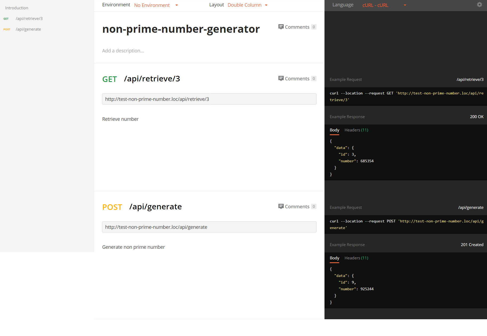

## Test case

Task: Напишите REST API для генерации рандомного натурального числа от 1 до 1,000,000. Исключить из генерации простые числа. Каждой генерации присваивать уникальный id по которому можно получить результат генерации. Должны быть доступны 2 публичных API метода generate() и retrieve(id). Можно использовать любой фреймворк.

